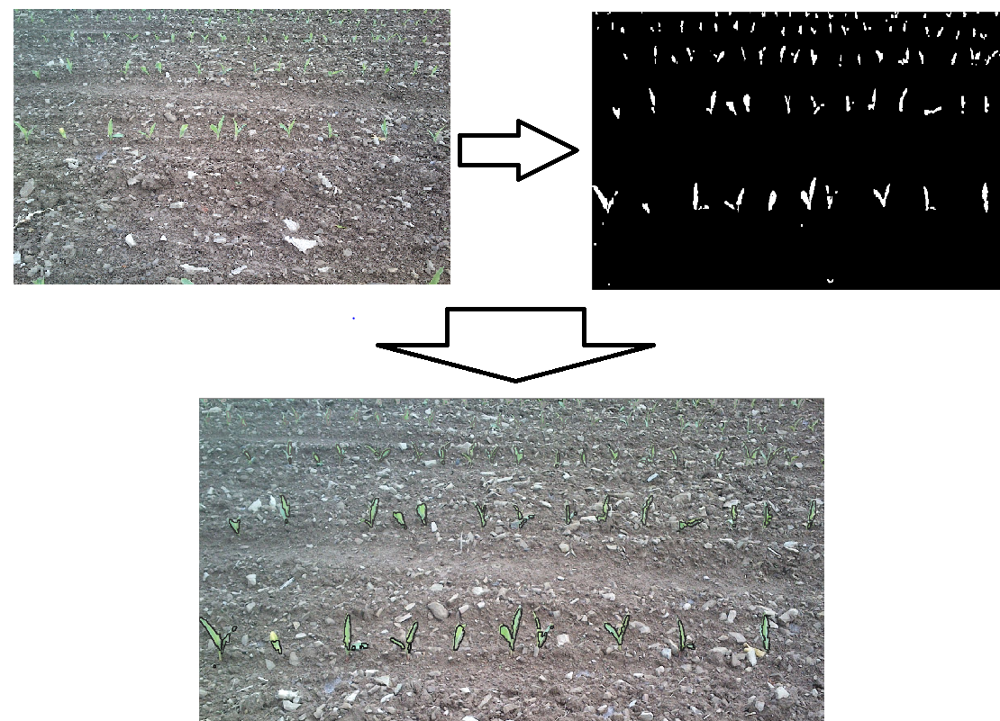

# Plant-counter-CV
Computer vision for counting plants in a image

## Getting Started

This is the repo to count the number of Plants or Germinations in a given image, by using HSV transformation. and count the number of plants or germinations using the contours count and thresholding concepts


### Packages required

* [Opencv](https://opencv.org/)

## usage

```
python Plant_counter --src <image-path>
e.g.: 
python Plant_counter.py --src foo/bar.jpg
```

## sample output



## Authors

* **Mallikarjun Sajjan**  - [mullermuttu](https://github.com/millermuttu)
